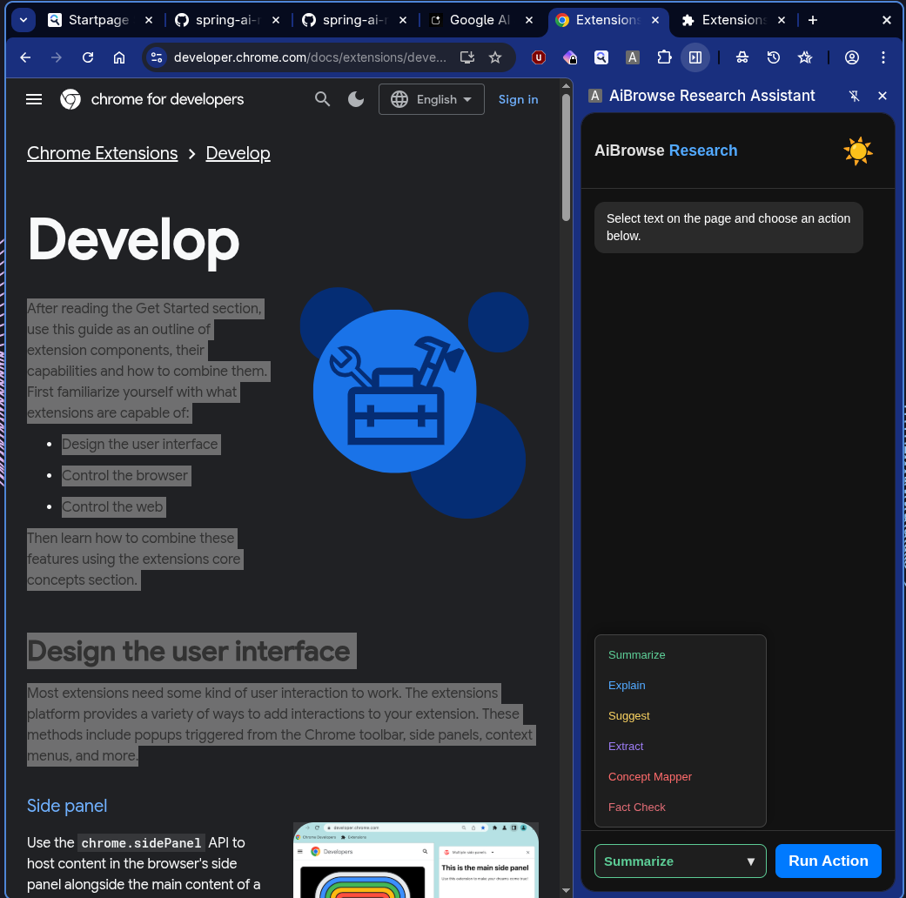
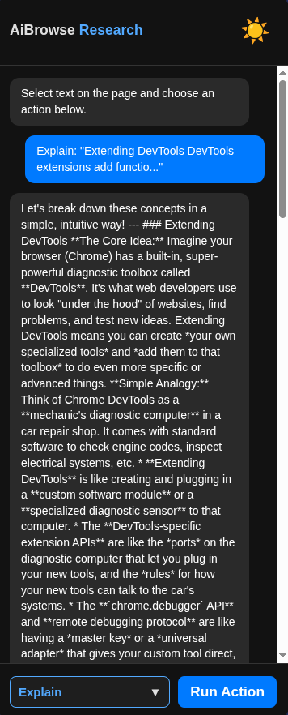
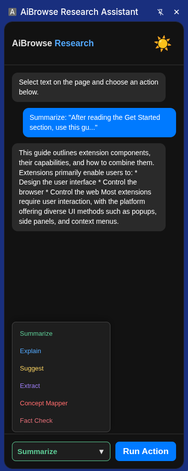

# AiBrowse Research Assistant 🚀

AiBrowse is a powerful Chrome Extension that transforms your browser into an AI-driven research hub. By combining a **Spring Boot** backend with a **React (Vite)** frontend, it allows you to summarize, explain, and fact-check web content instantly.

---

## ✨ Features

### 📝 Intelligent Summaries
Turn long articles into concise, actionable summaries in seconds.


### 💡 Deep Explanations
Complex technical jargon or academic concepts are broken down using intuitive analogies and real-world examples.


### 🗺️ Concept Mapping
Automatically identifies core technical concepts and suggests prerequisite topics you should learn first.


### 🌓 Dark & Light Modes
A fully responsive UI that respects your system theme preferences for comfortable late-night research sessions.


---

## 📋 Prerequisites

* **JRE 17+**: Required to run the backend service.
* **Google Chrome**: (Or any Chromium-based browser like Brave or Edge).
* **AI API Key**: Ensure your backend is configured with your preferred AI provider's key.

---

## 🚀 Getting Started

### 1. Run the Backend (Java)
The backend manages AI prompt engineering and processes your requests.
1. Download the latest `research-assistant-backend.jar`.
2. Open your terminal in the folder containing the jar.
3. Run the application:
   ```bash
   java -jar research-assistant-backend.jar
    ```

   ## 2. Install the Extension in Chrome
Since this is a developer version, you must load it as an "Unpacked" extension.

1. Open **Google Chrome** and navigate to `chrome://extensions/`.
2. Locate the **Developer mode** toggle in the top right corner and turn it **ON**.
3. Click the **Load unpacked** button that appears in the sub-header.
4. In the file picker, select the **`dist`** folder located within your project directory.
5. The **AiBrowse** icon should now appear in your extensions list and toolbar.

---

## 3. Verification
1. Click the **extension icon** (or the puzzle piece icon) to ensure the **Side Panel** opens correctly.
2. Highlight any text on a webpage and click **Run Action**.
3. Ensure your **backend terminal** shows an active connection or log entry when you trigger your first AI action.
